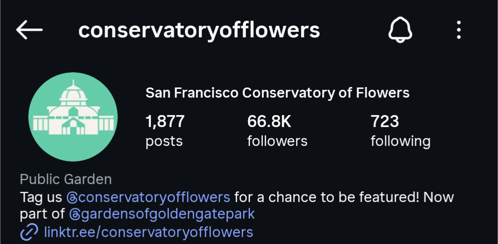

EDIT 3-30 5:10PM
<html lang="en">
<head>
  <meta charset="UTF-8"/>
  <meta name="viewport" content="width=device-width, initial-scale=1.0"/>
  <title>Sarah Sawtelle — Where Nature meets Narrative</title>
  <link rel="preconnect" href="https://fonts.googleapis.com">
  <link href="https://fonts.googleapis.com/css2?family=Fraunces:ital,opsz,wght@0,9..144,300;0,9..144,600;1,9..144,300;1,9..144,600&family=DM+Sans:wght@300;400&display=swap" rel="stylesheet">
  
</head>
<body>

  <nav>
    <a class="logo" href="#hero">Sarah Sawtelle</a>
    

      <a class="nav-link" href="#skills">Skills</a>
      <a class="nav-link" href="#work">Work</a>
      <a class="nav-link" href="#contact">Contact</a>
    

  </nav>

  <section id="hero">
    

      
Portfolio — Social Media & Interpretation

      <h1 class="hero-title">Sarah Sawtelle</h1>
      

        
Location

        
San Francisco, CA

      

      

        
Specialties

        
Social Media Content Creation & Management Interpretive Sign Creation Educational Program Development Volunteer Management

      

      

        
Available For

        
Freelance & Contract

      

      <a href="#work" class="hero-btn">View Work →</a>
    

    

      
    

  </section>

  

    01 —
    Skills & Specialisms
  

  <section id="skills" class="reveal">
    

      

        
◈

        
Social Media

        
Visual storytelling across Instagram, Facebook, YouTube, and more. Original photography, video, design, and writing to share your organization's story.

      

      

        
◉

        
Interpretive Sign Design

        
Educational signs for museums, parks, and gardens.

      

      

        
◎

        
Science Storytelling

        
Translating natural history and ecology into engaging programs for broad audiences.

      

    

  </section>

  

    02 —
    Selected Work
  

  <section id="work" class="reveal">

    <!-- Project 01: Instagram -->
    

      

        01
        

          Instagram
          Facebook
          Youtube
          
San Francisco Conservatory of Flowers

          <h3 class="project-title">Connecting People & Plants</h3>
          

            

              <b>January 2021 – December 2022</b>
              <ul style="margin-top: 0.7rem; padding-left: 1.2em; display: flex; flex-direction: column; gap: 0.5rem;">
                <li>Managed the San Francisco Conservatory of Flowers Instagram for two years while serving as Communications Manager.</li>
                <li>Shared dazzling photos of tropical plants alongside their remarkable botanical backstories.</li>
                <li>Behind-the-scenes reels brought viewers underwater to see the undersides of iconic Giant Water Lilies, and the ephemeral night bloom of a cactus flower.</li>
                <li>Utilized the HootSuite platform to manage a content calendar and cross-posting capabilities.</li>
                <li>Coordinated with events, retail, horticulture and operations teams to share news from across the organization with more than 60,000 followers.</li>
              </ul>
            

            
          

        

      

      

        
        
        
        
        
        
      

    

    <!-- Project 02: YouTube -->
    

      

        02
        

          Video
          
San Francisco Conservatory of Flowers

          <h3 class="project-title">YouTube Live — Corpse Flower Bloom</h3>
        

      

      

        
There is no event that brings more visitors to the garden than a bloom of the Corpse Flower. An impending bloom during a pandemic-era garden closure led me to make a quick pivot towards online programming. I envisioned and produced a series of YouTube Live programs that featured Conservatory staff and volunteers sharing the story of the Corpse Flower — its fascinating natural history and the role of botanical gardens in conservation. The bloom was even pollinated live on camera. An event that would normally bring thousands of visitors through the Conservatory's doors instead reached thousands of viewers across the world.

        
      

    

  </section>

  

    03 —
    Get in Touch
  

  <section id="contact" class="reveal">
    

      
Let's make something <em>worth seeing.</em>

      
Whether you need social content, interpretive signage, or science communication design, I'd love to hear about your project.

    

    <form class="contact-form" id="contact-form" onsubmit="submitForm(event)" novalidate>
      

        

          <label for="cf-name">Name</label>
          <input type="text" id="cf-name" name="name" placeholder="Your name" required>
        

        

          <label for="cf-email">Email</label>
          <input type="email" id="cf-email" name="email" placeholder="your@email.com" required>
        

      

      

        <label for="cf-subject">Subject</label>
        <input type="text" id="cf-subject" name="subject" placeholder="Project type or enquiry">
      

      

        <label for="cf-message">Message</label>
        <textarea id="cf-message" name="message" rows="5" placeholder="Tell me about your project…" required></textarea>
      

      
Thank you — I'll be in touch soon.

      <button type="submit" class="form-submit">Send Message →</button>
    </form>
  </section>

  <footer>
    © 2026 Sarah Sawtelle
    Natural History · Science Communication · Environmental Design
  </footer>

  
</body>
</html>

