<html lang="en">
<head>
  <meta charset="UTF-8"/>
  <meta name="viewport" content="width=device-width, initial-scale=1.0"/>
  <title>Sarah Sawtelle — Where Nature meets Narrative</title>
  <link rel="preconnect" href="https://fonts.googleapis.com">
  <link href="https://fonts.googleapis.com/css2?family=Fraunces:ital,opsz,wght@0,9..144,300;0,9..144,600;1,9..144,300;1,9..144,600&family=DM+Sans:wght@300;400&display=swap" rel="stylesheet">
  
</head>
<body>

  <section id="hero">
    

      
Portfolio

      <h1 class="hero-title" style="color: #7a4a1a;">Sarah Sawtelle</h1>
      

        
Location

        
San Francisco, CA

      

      

        
About Me

        
Informal science educator who crafts stories that spark awe and appreciation for the natural world. I work with conservation organizations, parks, museums, and cultural institutions throughout the Bay Area and beyond. Let me help you by creating compelling social media posts, inspiring interpretive signs, or lively educational programs. I also have experience in volunteer coordination, project management, and public speaking.

      

      

        
Available For

        
Freelance & Contract

      

    

    

      
    

  </section>

  <section id="skills" class="reveal">
    

      <a href="#work" style="text-decoration: none; color: inherit; display: contents;">
      

        
◈

        
Social Media

        
Visual storytelling across Instagram, Facebook, YouTube, and more. Original photography, video, design, and writing to share your organization's story.

      

      </a>
      <a href="#signs" style="text-decoration: none; color: inherit; display: contents;">
      

        
◉

        
Interpretive Sign Development

        
Educational signs for museums, parks, and gardens.

      

      </a>
      <a href="#storytelling" style="text-decoration: none; color: inherit; display: contents;">
      

        
◎

        
Science Storytelling

        
Translating natural history and ecology into engaging programs for broad audiences.

      

      </a>
    

  </section>

  

    Social Media
  

  <section id="work" class="reveal">

    <!-- Project 01: Instagram -->
    

      

        <svg xmlns="http://www.w3.org/2000/svg" viewBox="0 0 24 24" width="28" height="28" fill="none" stroke="#a8c898" stroke-width="2" stroke-linecap="round" stroke-linejoin="round"><path d="M11 20A7 7 0 0 1 9.8 6.1C15.5 5 17 4.48 19 2c1 2 2 4.18 2 8 0 5.5-4.78 10-10 10Z"/><path d="M2 21c0-3 1.85-5.36 5.08-6C9.5 14.52 12 13 13 12"/></svg>
        

          <h2 style="font-family: 'Fraunces', serif; font-size: 1.6rem; font-weight: 600; color: #2a2318; margin-top: -0.2rem; margin-bottom: 0.5rem; line-height: 1;">San Francisco Conservatory of Flowers</h2>
          

              <b>January 2021 – December 2022 · Interim Communications Manager</b>
              <ul style="margin-top: 0.7rem; padding-left: 1.2em; display: flex; flex-direction: column; gap: 0.5rem;">
                <li>Took dazzling photos and videos of tropical plants, shared alongside their botanical backstories on Instagram, YouTube, and Facebook.</li>
                <li>Filmed reels that took viewers behind-the-scenes to dive underwater with Giant Water Lilies, and witness the ephemeral night bloom of a cactus flower.</li>
                <li>Used Hootsuite to create content calendar, schedule posts, and manage posting across multiple platforms.</li>
                <li>Coordinated with events, retail, horticulture and operations teams to share news from across the organization with more than 60,000 followers.</li>
              </ul>
            

          

            

              <!-- Instagram -->
              <a class="ig-card-link" href="https://www.instagram.com/conservatoryofflowers/" target="_blank" rel="noopener">
              

                

                  

                    <svg xmlns="http://www.w3.org/2000/svg" viewBox="0 0 24 24" width="24" height="24">
                      <defs>
                        <radialGradient id="ig-g" cx="30%" cy="107%" r="150%">
                          <stop offset="0%" stop-color="#fdf497"/>
                          <stop offset="45%" stop-color="#fd5949"/>
                          <stop offset="60%" stop-color="#d6249f"/>
                          <stop offset="90%" stop-color="#285AEB"/>
                        </radialGradient>
                      </defs>
                      <rect width="24" height="24" rx="5.5" fill="url(#ig-g)"/>
                      <circle cx="12" cy="12" r="4.5" fill="none" stroke="#fff" stroke-width="1.8"/>
                      <circle cx="17.5" cy="6.5" r="1.1" fill="#fff"/>
                    </svg>
                  

                  

                    
@conservatoryofflowers

                    
Instagram

                  

                

                

                  
660Posts

                  
67KFollowers

                

              

              </a>
              <!-- YouTube -->
              <a class="ig-card-link" href="https://www.youtube.com/@ConservatoryofFlowers" target="_blank" rel="noopener">
              

                

                  

                    <svg xmlns="http://www.w3.org/2000/svg" viewBox="0 0 24 24" width="24" height="24">
                      <rect width="24" height="24" rx="5" fill="#FF0000"/>
                      <polygon points="10,7.5 10,16.5 18,12" fill="#fff"/>
                    </svg>
                  

                  

                    
Conservatory of Flowers

                    
YouTube

                  

                

                

                  
1KSubscribers

                

              

              </a>
              <!-- Facebook -->
              <a class="ig-card-link" href="https://www.facebook.com/ConservatoryofFlowers" target="_blank" rel="noopener">
              

                

                  

                    <svg xmlns="http://www.w3.org/2000/svg" viewBox="0 0 24 24" width="24" height="24">
                      <rect width="24" height="24" rx="5" fill="#1877F2"/>
                      <path d="M13.5 8H15V5.5h-1.5C11.57 5.5 10 7.07 10 9v1.5H8V13h2v8h3v-8h2l.5-2.5H13V9c0-.28.22-.5.5-.5z" fill="#fff"/>
                    </svg>
                  

                  

                    
@conservatoryofflowers

                    
Facebook

                  

                

                

                  
23KFollowers

                

              

              </a>
            

      

      

        
        <a class="project-grid-link" href="https://www.instagram.com/p/Chk3u_SDijd/?hl=en" target="_blank" rel="noopener">
          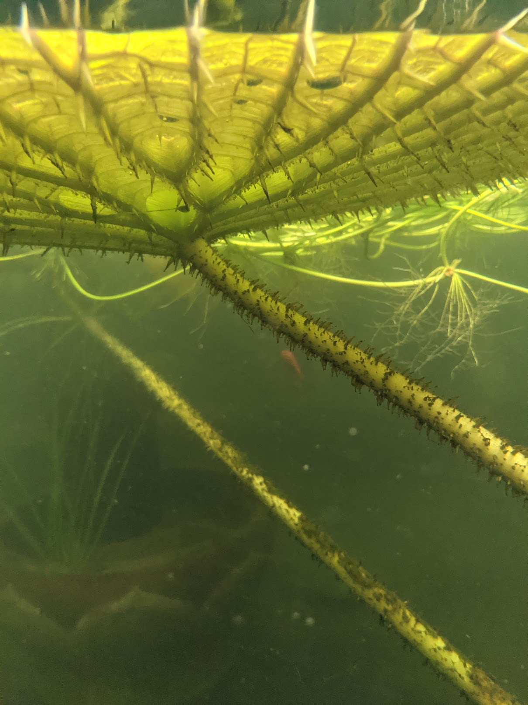
        </a>
        <a class="project-grid-link" href="https://www.instagram.com/p/CcGPQgtp826/?hl=en&img_index=1" target="_blank" rel="noopener">
          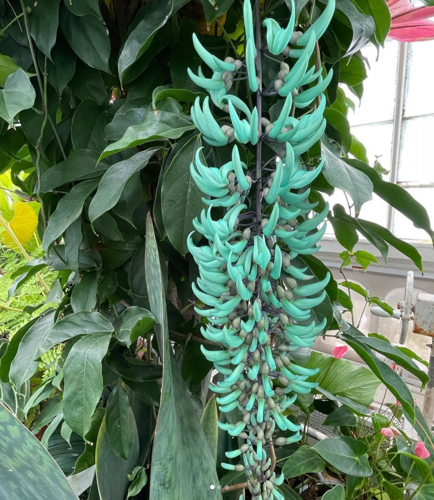
        </a>
        <a class="project-grid-link" href="https://www.instagram.com/p/CeEmW9vlS5r/?hl=en" target="_blank" rel="noopener">
          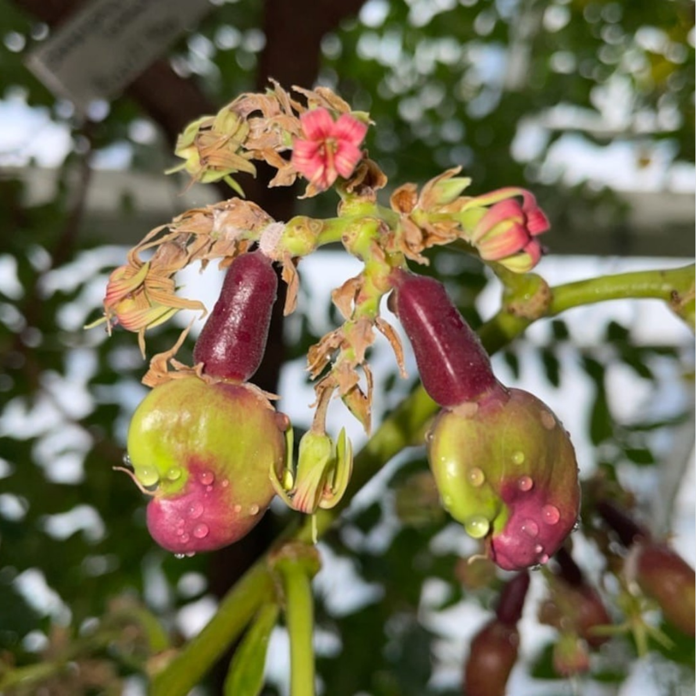
        </a>
        
        <a class="project-grid-link" href="https://www.instagram.com/p/CezZZv6jnNj/?hl=en" target="_blank" rel="noopener">
          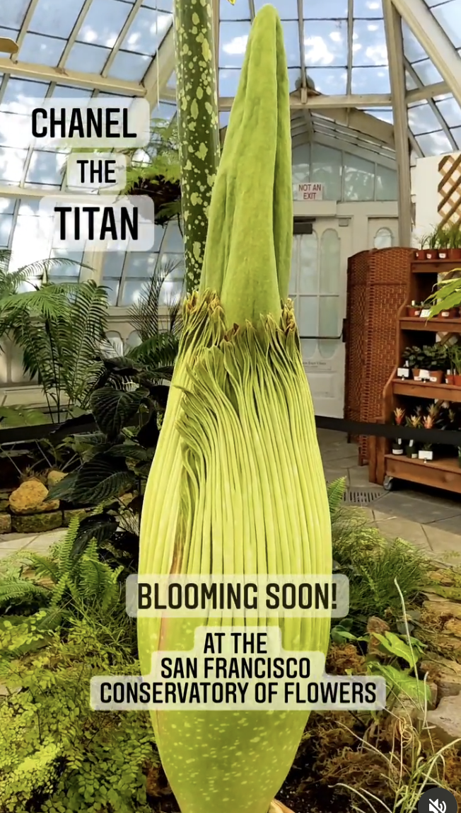
        </a>
      

      

        

          

            <h3 class="project-title" style="font-family: 'Fraunces', serif; font-size: 1.1rem; font-weight: 300; font-style: italic; color: #2a2318; margin-bottom: 0.3rem;">YouTube Live — Corpse Flower Bloom</h3>
            <ul class="project-desc" style="padding-left: 1.2em; display: flex; flex-direction: column; gap: 0.5rem;">
              <li>Produced and streamed a series of YouTube Live educational programs that attracted over 5,000 viewers to learn about Corpse Flower natural history and conservation.</li>
              <li>Moderated online livestream of Corpse Flower bloom that drew 60,000+ viewers.</li>
            </ul>
          

          
        

      

    

    <!-- Project 02: Secrets of Golden Gate Park -->
    

      

        <svg xmlns="http://www.w3.org/2000/svg" viewBox="0 0 24 24" width="28" height="28" fill="none" stroke="#a8c898" stroke-width="2" stroke-linecap="round" stroke-linejoin="round"><path stroke="none" d="M0 0h24v24H0z" fill="none"/><path d="M5 21c.5 -4.5 2.5 -8 7 -10"/><path d="M9 18c6.218 0 10.5 -3.288 11 -12v-2h-4.014c-9 0 -11.986 4 -12 9c0 1 0 3 2 5h3z"/></svg>
        

          <h2 style="font-family: 'Fraunces', serif; font-size: 1.6rem; font-weight: 600; color: #2a2318; margin-top: -0.2rem; margin-bottom: 0.5rem; line-height: 1;">Secret Golden Gate Park</h2>
          

            

              <b>February – April 2026 · Freelance Social Media Manager</b>
              <ul style="margin-top: 0.7rem; padding-left: 1.2em; display: flex; flex-direction: column; gap: 0.5rem;">
                <li>Created and posted Instagram reels, stories and posts in support of the release of <em>Golden Gate Park: A Local's Guide</em> and related book events.</li>
                <li>Collaborated to develop brand style for a client with a preference for bold, eye-popping and text-intensive posts.</li>
                <li>Integrated @secretgoldengatepark Instagram with Canva, Metricool and Linktree.</li>
              </ul>
            

            

              <a class="ig-card-link" href="https://www.instagram.com/secretgoldengatepark/" target="_blank" rel="noopener">
              

                

                  

                    <svg xmlns="http://www.w3.org/2000/svg" viewBox="0 0 24 24" width="24" height="24">
                      <defs>
                        <radialGradient id="ig-g2" cx="30%" cy="107%" r="150%">
                          <stop offset="0%" stop-color="#fdf497"/>
                          <stop offset="45%" stop-color="#fd5949"/>
                          <stop offset="60%" stop-color="#d6249f"/>
                          <stop offset="90%" stop-color="#285AEB"/>
                        </radialGradient>
                      </defs>
                      <rect width="24" height="24" rx="5.5" fill="url(#ig-g2)"/>
                      <circle cx="12" cy="12" r="4.5" fill="none" stroke="#fff" stroke-width="1.8"/>
                      <circle cx="17.5" cy="6.5" r="1.1" fill="#fff"/>
                    </svg>
                  

                  

                    
@secretgoldengatepark

                    
Instagram

                  

                

                

                  
227Followers

                

              

              </a>
            

          

        

      

      

        
        <a class="project-grid-link" href="https://www.instagram.com/p/DVUCEhYFP6a/?img_index=1" target="_blank" rel="noopener">
          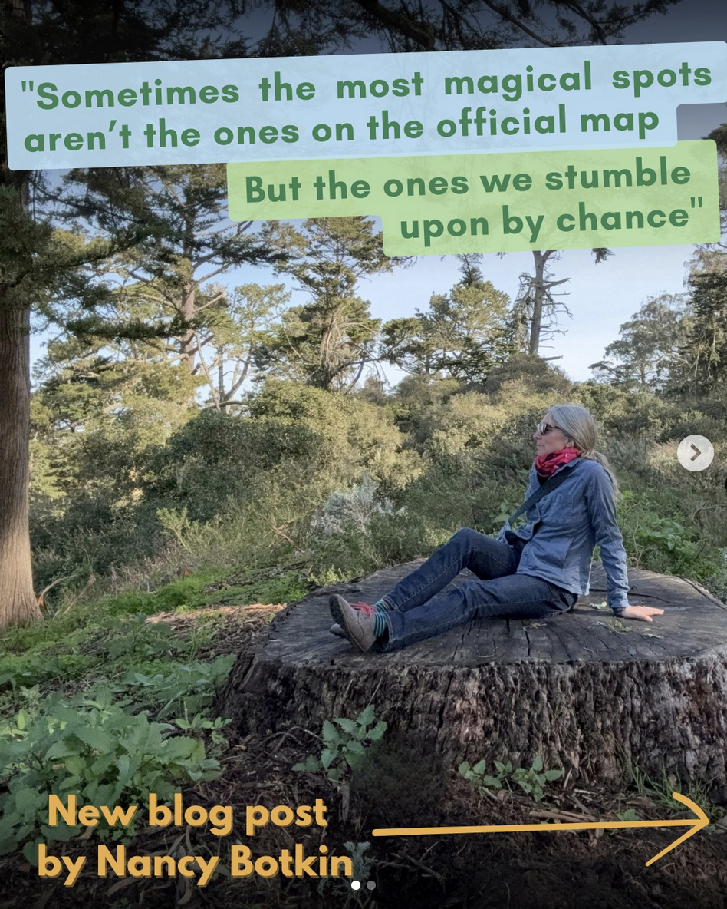
        </a>
        <a class="project-grid-link" href="https://www.instagram.com/stories/highlights/18434294539112364/" target="_blank" rel="noopener">
          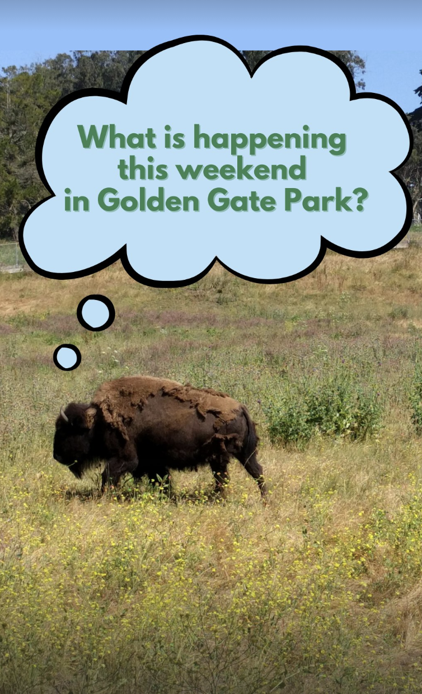
        </a>
        <a class="project-grid-link" href="https://www.instagram.com/p/DWeb8zajKOp/" target="_blank" rel="noopener">
          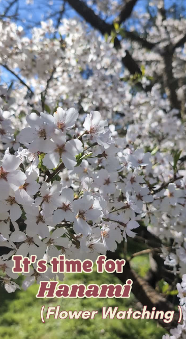
        </a>
        
        <a class="project-grid-link" href="https://www.instagram.com/p/DVXs45vjTk7/" target="_blank" rel="noopener">
          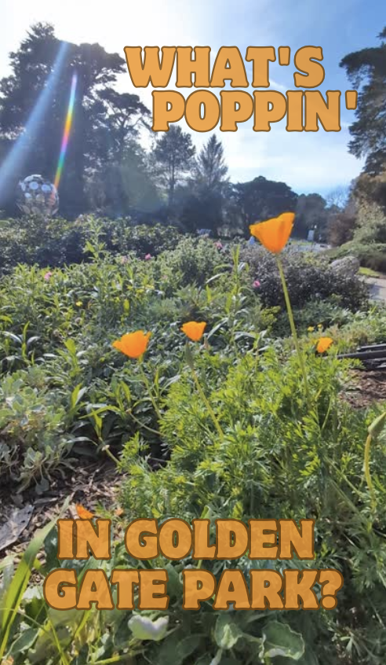
        </a>
      

    

  </section>

  

    Interpretive Sign Development
  

  <section id="signs" class="reveal">
    

      

        <svg xmlns="http://www.w3.org/2000/svg" viewBox="0 0 24 24" width="28" height="28" fill="none" stroke="#a8c898" stroke-width="2" stroke-linecap="round" stroke-linejoin="round"><path stroke="none" d="M0 0h24v24H0z" fill="none"/><path d="M5 21c.5 -4.5 2.5 -8 7 -10"/><path d="M9 18c6.218 0 10.5 -3.288 11 -12v-2h-4.014c-9 0 -11.986 4 -12 9c0 1 0 3 2 5h3z"/></svg>
        

          <h2 style="font-family: 'Fraunces', serif; font-size: 1.6rem; font-weight: 600; color: #2a2318; margin-top: -0.2rem; margin-bottom: 0.5rem; line-height: 1;">Gardens of Golden Gate Park &amp; Conservatory of Flowers</h2>
          
<b>2019 – 2024 · Interpretation and Engagement Manager</b>

        

      

      

        <a class="project-grid-link" href="images/sign-01.png" target="_blank" rel="noopener">
          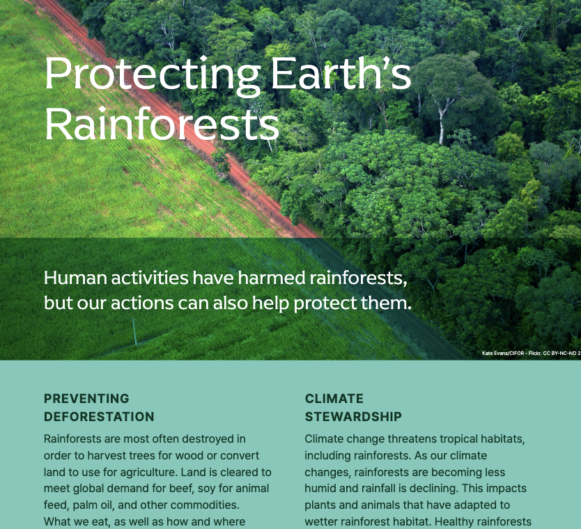
        </a>
        <a class="project-grid-link" href="images/sign-02.png" target="_blank" rel="noopener">
          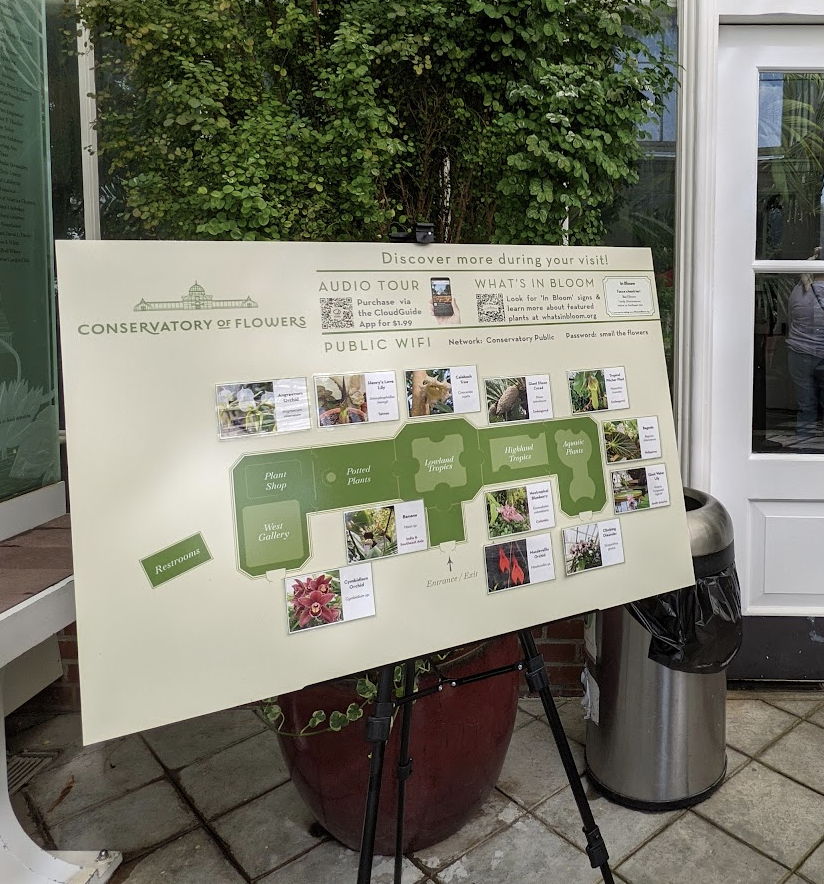
        </a>
        <a class="project-grid-link" href="images/sign-03.png" target="_blank" rel="noopener">
          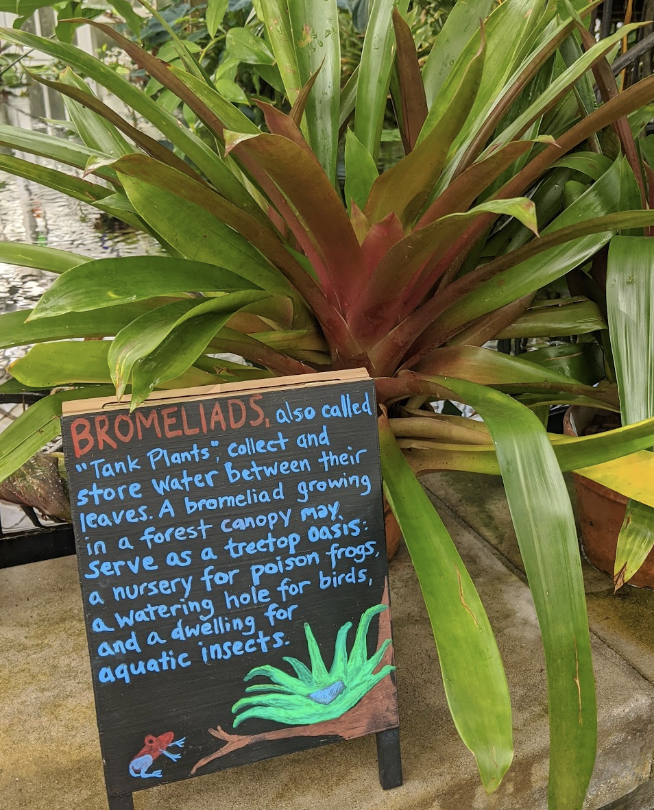
        </a>
        <a class="project-grid-link" href="images/sign-04.png" target="_blank" rel="noopener">
          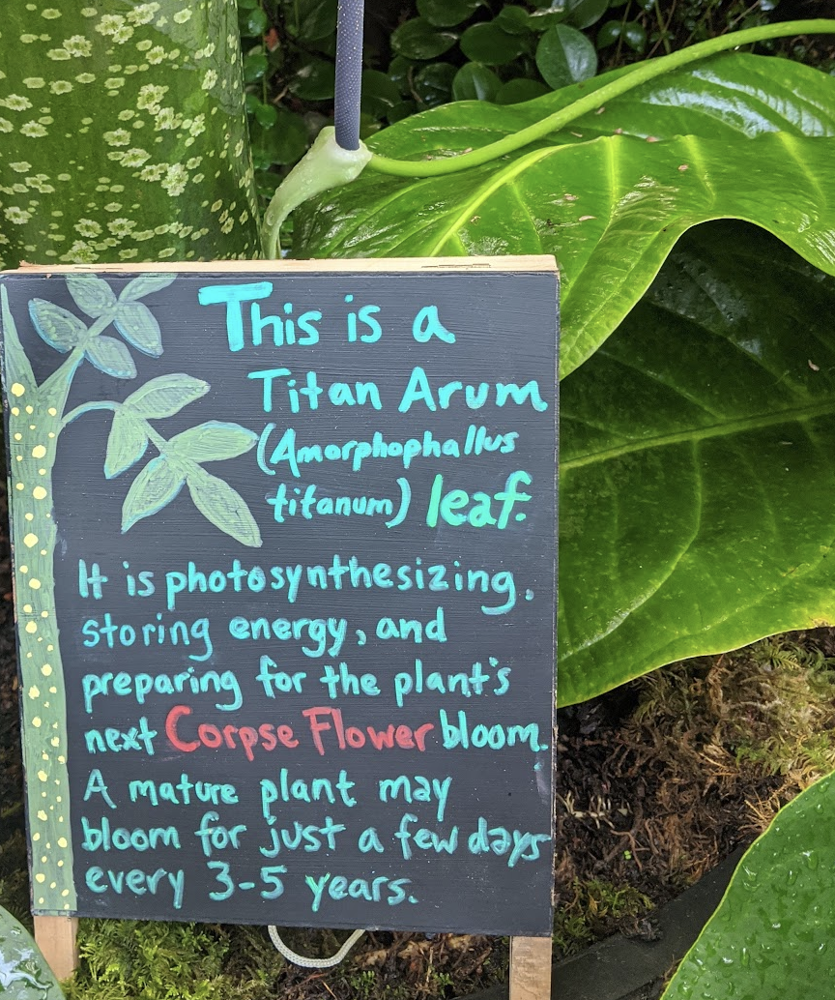
        </a>
        <a class="project-grid-link" href="images/sign-05.jpg" target="_blank" rel="noopener">
          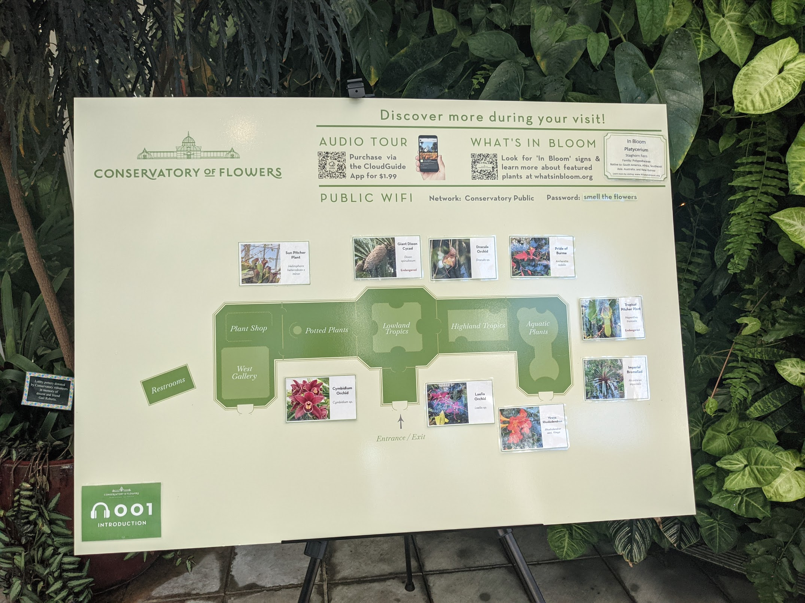
        </a>
        <a class="project-grid-link" href="images/sign-06.png" target="_blank" rel="noopener">
          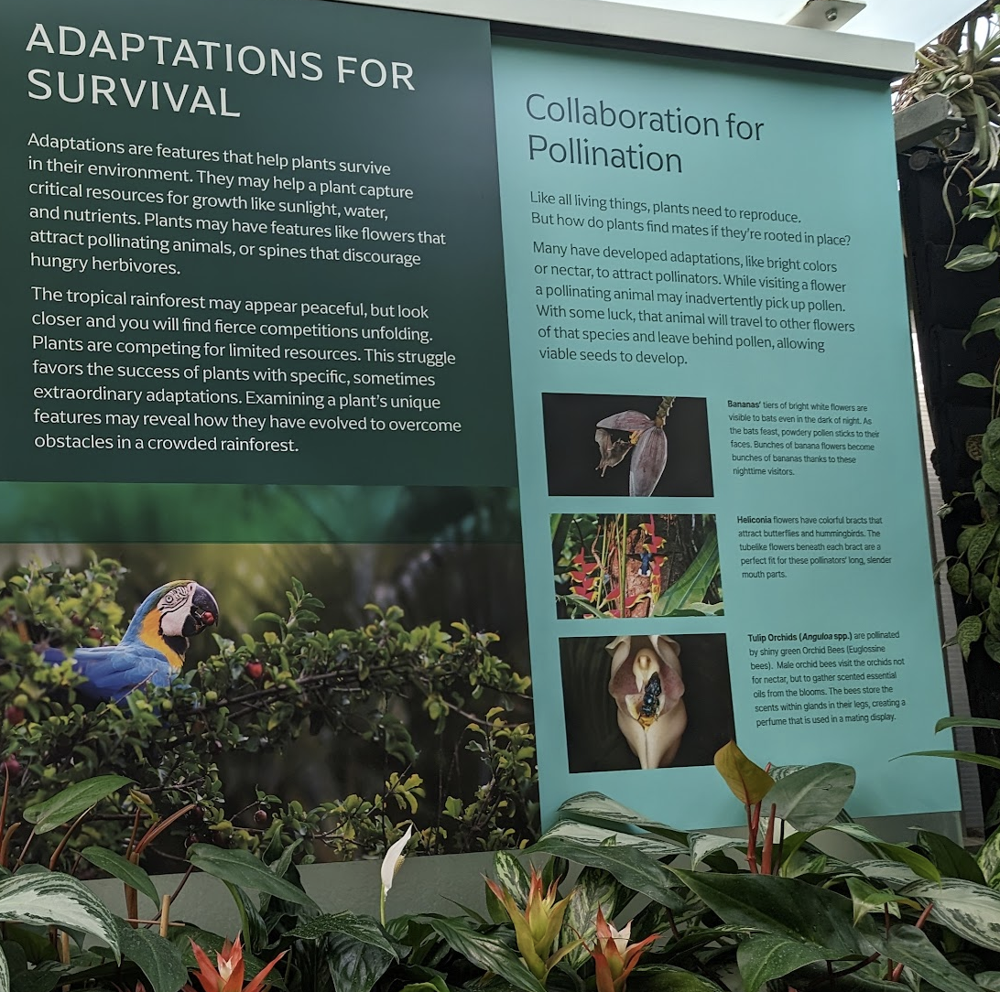
        </a>
      

    

  </section>

  

    Science Storytelling
  

  <section id="storytelling" class="reveal">
    

      
Content coming soon.

    

  </section>

  

    Get in Touch
  

  <section id="contact" class="reveal">
    

      
Let's make something <em>worth seeing.</em>

      
Whether you need social content, interpretive signage, or science communication design, I'd love to hear about your project.

    

    <form class="contact-form" id="contact-form" onsubmit="submitForm(event)" novalidate>
      

        

          <label for="cf-name">Name</label>
          <input type="text" id="cf-name" name="name" placeholder="Your name" required>
        

        

          <label for="cf-email">Email</label>
          <input type="email" id="cf-email" name="email" placeholder="your@email.com" required>
        

      

      

        <label for="cf-subject">Subject</label>
        <input type="text" id="cf-subject" name="subject" placeholder="Project type or enquiry">
      

      

        <label for="cf-message">Message</label>
        <textarea id="cf-message" name="message" rows="5" placeholder="Tell me about your project…" required></textarea>
      

      
Thank you — I'll be in touch soon.

      <button type="submit" class="form-submit">Send Message →</button>
    </form>
  </section>

  <footer>
    © 2026 Sarah Sawtelle
    Natural History · Science Communication · Environmental Design
  </footer>

  
</body>
</html>

